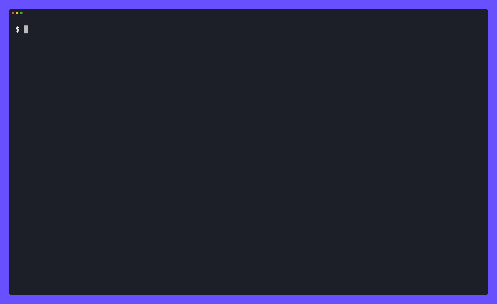
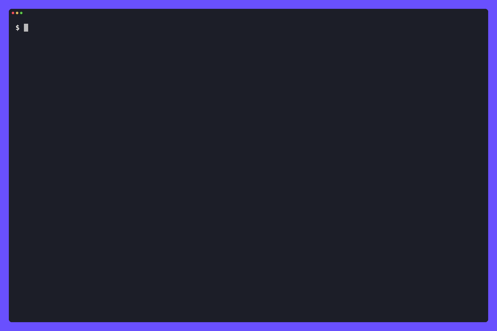

# secure-guard

A [Claude Code mod](https://code.claude.com/docs/en/plugins/mods/overview) that puts Mondoo's
scanners in the loop as an AI agent works — routing each tool call to the right engine:



- **Shell guard (xgrep)** — holds a risky Bash command behind a Proceed / Cancel pane until
  you answer. xgrep here **keeps secrets and PII from leaving**: a token or an SSN in the
  command, credential files, a secret sent by variable name, or the whole environment piped
  to a remote host. It also holds remote code piped into a shell, reverse shells, and
  destructive commands (`rm -rf` of home or root, a force-push to `main`, `DROP DATABASE`,
  `chmod -R 777 /`). Each of these is a [category](#tuning-the-guard) you can tune.
- **Inline code review (xgrep)** — after the agent writes or edits code, scans it and hands
  high-confidence findings back right after the tool result so the agent fixes them in the
  same turn. xgrep here **enforces the OWASP Top 10** (SAST taint) plus SCA and secrets on the
  code. The transcript says what Mondoo caught — *"Mondoo xgrep found 1 issue in app.py: SQL
  injection (python-sql-injection), line 15. Sent to Claude to address."* — right under the
  edit, so you can see why the agent touched code you didn't ask about.

  
- **IaC policy guard (cnspec)** — after the agent writes or edits Terraform, a Dockerfile, or
  a Kubernetes / CloudFormation manifest, runs cnspec policy checks and hands violations back
  the same way. Terraform and Dockerfiles get the xgrep review too, so a hard-coded secret in
  `main.tf` is still caught.
- **False-positive reports** — when the agent is confident an xgrep finding is wrong, it can
  report it to this repo with a reproducible case so the rule gets fixed. You review the exact
  issue and decide whether to file it ([details](#reporting-false-positives)).

So xgrep runs in two complementary modes — **prevent secrets/PII leaving** (guard) and
**enforce the OWASP Top 10 on code** (scan) — and cnspec adds IaC policy. This single routing
and finding logic lives in [`hooks/core.mjs`](./hooks/core.mjs), shared with the other agent
adapters; this file is the Claude Code adapter.

Inline review is **advisory** (the edit always lands); only the shell guard can hold/block.
Everything is **fail-open**: a scanner that is missing, too old, or errors never wedges your
session.

## Install

```
/plugin install secure-guard --marketplace mondoohq/secure-stack
```

That works in one step on Claude Code 2.1.275 or later. On an older version, add the
marketplace first:

```bash
claude plugin marketplace add mondoohq/secure-stack
claude plugin install secure-guard@secure-stack
```

The mod loads in your next session. Run `/secure-guard` to check it is reaching its engines.

## The two engines

- **xgrep** (shell + code) — fetched automatically from the public npm package if a
  new-enough one isn't installed. Learn more: [xgrep.ai](https://xgrep.ai) /
  [docs](https://mondoo.com/docs/xgrep).
- **cnspec** (IaC policy) — must be [installed](https://mondoo.com/docs/cnspec/install)
  (`CNSPEC_PATH` or `cnspec` on `PATH`). If it isn't, the IaC guard stays silently off.

### Where the IaC policies come from

The IaC guard works with no configuration. By default it runs the latest public
[cnspec policy bundles](https://github.com/mondoohq/cnspec/tree/main/content) that match the
file (Terraform: AWS/Azure/GCP security; Dockerfile and Kubernetes: security and best
practices; CloudFormation: AWS security). cnspec downloads them from GitHub when it scans.

**Only policies come down. Your files never go up.** cnspec evaluates the file on your machine,
runs `--incognito`, and reports results to nowhere but the agent. The first download in a
session is announced with a toast and a transcript line, so it is never silent.

Other policy sources, in precedence order:

| Set | Policies | Network |
|-----|----------|---------|
| `CNSPEC_POLICY_BUNDLE` | your bundle(s): comma-separated local paths, `https://` or `s3://` URLs | only if a URL |
| `CNSPEC_CONTENT_DIR` | the same public bundles, from a local [cnspec](https://github.com/mondoohq/cnspec) `content/` checkout | **none, fully offline** |
| `CNSPEC_USE_PLATFORM=1` | the policies assigned in your logged-in Mondoo Platform space | cnspec **reports the scan results to your space** (opt-in for that reason) |
| *(nothing)* | the latest public bundles | policies download; nothing is uploaded |

A custom bundle needs policy **filters that match the IaC platform** you're scanning
(`terraform-hcl`, `dockerfile`, `k8s`, `cloudformation`), or cnspec has nothing to run.

## Local by design

Every check runs **on your machine**. xgrep scans each command and file itself (no service in
between), and cnspec evaluates IaC files locally. Your commands and code are never uploaded,
and nothing is evaluated server-side. That matters for two reasons:

- **Fast**: there's no network round-trip per tool call. A scan is a local pass, so guarding
  every command and write doesn't add server latency to the session.
- **Private**: the code being scanned never leaves your machine.

What does cross the network is listed below. The guard announces the xgrep fetch and the
policy download in the session the first time each happens:

| What | When | Direction |
|------|------|-----------|
| the xgrep binary, from the public [`@mondoohq/xgrep`](https://www.npmjs.com/package/@mondoohq/xgrep) npm package | only if no xgrep ≥ 0.84 is installed | down: the scanner, not your data |
| a version check against [install.mondoo.com](https://install.mondoo.com) | xgrep's own, when the guard runs `xgrep version` to probe it; cached for 24 h; off with `XGREP_UPDATE_CHECK=0` or `DO_NOT_TRACK=1` | down: the latest version number |
| a newer xgrep, from the npm package | only when you run `/secure-guard update` | down: the scanner |
| cnspec policy bundles, from [github.com/mondoohq/cnspec](https://github.com/mondoohq/cnspec/tree/main/content) | on an IaC scan, unless `CNSPEC_CONTENT_DIR` points at a local copy | down: policies only |
| cnspec providers (e.g. its Terraform provider) | on an IaC scan, when cnspec's own `--auto-update` (on by default) finds one missing or outdated | down: cnspec's plugins |
| scan results to your Mondoo Platform space | only with `CNSPEC_USE_PLATFORM=1` | up, by your choice |
| a false-positive issue on [github.com/mondoohq/secure-stack](https://github.com/mondoohq/secure-stack/issues) (public) | only when you press **File issue** after reviewing it | up: a minimal repro written for the report, never your files |

Installing xgrep (`npm i -g @mondoohq/xgrep`) and setting `CNSPEC_CONTENT_DIR` removes the
first two. The provider check is cnspec's own behavior and follows its `--auto-update` setting.

## Reporting false positives

A rule that fires on correct code costs every user a detour, so the guard gives the agent a
way to report it instead of "fixing" code that is already right. Every code finding the agent
reads ends with a pointer to the mod's `report_false_positive` tool, which takes the rule id,
the language, a **minimal snippet that still triggers the rule**, and why the finding is wrong.

1. **Checked before you see it.** The mod runs
   `xgrep scan --stdin --lang <language> --rule-id <rule> --json` on the snippet. A snippet
   that doesn't trigger the rule, an unknown rule id, or an incomplete report goes back to the
   agent to fix, so you only ever review reports a maintainer can reproduce.
2. **You review the exact issue.** A pane shows the title, the reason, and the repro, and
   **nothing is sent unless you press File issue**. The repo is public, so the agent is told
   to write the snippet for the report and never paste your code, names, paths, or secrets.
3. **Filed as you.** The mod runs `gh issue create --repo mondoohq/secure-stack` with the
   `false-positive` label (without it, if the repo doesn't have the label). Without a working
   [GitHub CLI](https://cli.github.com), the agent gives you a prefilled link to submit
   yourself instead.

The issue carries the rule id, xgrep version, the repro in a code block, the one-line command
that reproduces it, and the reason, which is what a maintainer needs to adjust the rule.

## Trust

A mod runs with your permissions inside Claude Code. It can read files, start processes
(including the xgrep download above), and make network requests. Review it before you
install it: `claude plugin validate mods/secure-guard` lists every event it hooks, every
capability it uses (`$.process`, `$.fs`, `$.http`, …), and every environment variable it
reads. This mod only reaches outside its own code through those capabilities, so that list is
the complete picture. Install mods only from sources you trust.

## Status in a session

Run `/secure-guard` to see how it's reaching each engine (xgrep: daemon / in-process /
fetched; cnspec: available / not installed), and whether a newer xgrep is available.

## Tuning the guard

Every shell-guard rule belongs to a category: `secrets`, `pii`, `remote-code`,
`remote-access`, `exfiltration`, `destructive`, `code-execution`, `obfuscation`. Each one
blocks by default (the guard holds the command for you). To change that, set a category's mode
to `block`, `ask`, `warn` or `off` in a `guard.yaml`. xgrep reads it, so it applies to the
guard without any setting in the mod:

```yaml
# <user config dir>/xgrep/guard.yaml  — e.g. ~/.config/xgrep/guard.yaml, or
# ~/Library/Application Support/xgrep/guard.yaml on macOS
categories:
  pii: off          # we redact PII elsewhere
  destructive: ask
```

A repository's own `.xgrep/guard.yaml` can only make a category **stricter**: a repo you clone
can't switch your guard off. Run `xgrep guard categories` to see each category's mode and where
it came from; the [xgrep guard docs](https://mondoo.com/docs/xgrep/ai-agents/guard-hooks)
have the details.

## Keeping xgrep current

New xgrep releases add and sharpen the rules the guard runs, so an outdated xgrep quietly
catches less. xgrep already checks for newer releases itself when it reports its version,
which the guard does to probe it. The guard reads that answer, so it makes no network call of
its own, and xgrep's opt-outs (`XGREP_UPDATE_CHECK=0`, `DO_NOT_TRACK=1`) turn the notice off.
With an xgrep that supports `version --json --check-update`, the guard reads the answer as
structured data; with an older one, it reads xgrep's update notice instead.

When a newer xgrep is out, the transcript says so, at most once a day per version:

```
secure-guard: xgrep 0.83.0 is available (you have 0.81.0 at /opt/homebrew/bin/xgrep).
Run /secure-guard update to install it — it runs: npm --prefix /opt/homebrew install -g @mondoohq/xgrep@latest
```

Run **`/secure-guard update`** to install it. The guard then switches to the new binary right
away. What the update does depends on how xgrep is installed:

- **An npm global install** (including one under Homebrew's Node) is updated in place, with
  the npm prefix it lives under, so it updates the copy the guard actually runs.
- **No local install** (the guard was using the npm package it fetched): a global copy is
  installed, and the guard prefers it from then on.
- **Anything else** (a release download, a development build) is left alone, and you get the
  link to [install.mondoo.com](https://install.mondoo.com) to update it the way you installed it.

The update only runs when you type `/secure-guard update` yourself. It never runs for the
model, the SDK or another plugin, because it changes software on your machine.

## Testing

Pure logic (finding filters, path routing, SARIF parsing, advisory text, version checks) is
unit-tested; an end-to-end scenario drives the engines against the real binaries:

```bash
node --test hooks/*.test.mjs                 # unit tests (no binaries needed)
claude plugin test .                         # hook-level tests, run by Claude Code itself
node test/pipeline-scenario.mjs              # end-to-end (XGREP_PATH / CNSPEC_PATH to skip the download)
```

The repo's build/validate/test commands are in the root [`AGENTS.md`](../../AGENTS.md).

## Recording the demos

Both GIFs are real Claude Code sessions, recorded with [VHS](https://github.com/charmbracelet/vhs)
from the repo root (needs `claude`, `vhs`, `node`):

```bash
vhs mods/secure-guard/demo/demo.tape            # demo.gif — the shell guard holds a piped installer
vhs mods/secure-guard/demo/inline-review.tape   # demo-inline-review.gif — xgrep review, fixed in the same turn
```

[`demo/setup.sh`](demo/setup.sh) runs off camera. It loads this checkout's mod and disables any
installed copy, makes sure a guard-capable xgrep is on `PATH`, and starts Claude in
accept-edits mode with Bash and the report tool allowed, so the guard's own panes are the only
prompts on screen. The demo project is `.demo/acme-app` at the repo root (gitignored): it has to
live outside the mod's folder, because Claude Code asks before any edit inside a loaded plugin.

The tapes wait for what's on screen rather than fixed timings, so Claude's response time
doesn't break a take; its wording varies a little between takes. The installer URL is on the
reserved `example.com` domain, so nothing can run even if Proceed were pressed. The inline
review starts from [`demo/fixtures/app.py`](demo/fixtures), an intentionally vulnerable file.

## License

[Apache License 2.0](./LICENSE). The xgrep and cnspec binaries it invokes are distributed
under their own terms.
